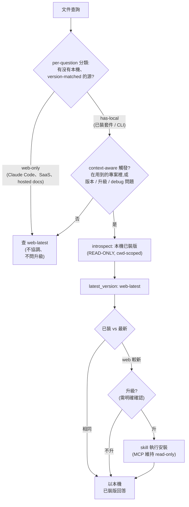

> [English](Version-Reconciliation) | 繁體中文

# 版本協調流程 — 自動偵測更新

當一個目標同時有 web-latest 和本機已裝版時, LiveDocs 偵測落差並提供升級。貫穿每個分支的規則:

> 以你的本機已裝版回答。web-latest 只用來判斷你是否落後、以及提供升級, 不當答案本身。

## 說明

- 分類是 per-question。同一工具可兼兩者:「怎麼設定 Claude Code」是 web-only;「已裝的 `claude` 有什麼 flag」是 has-local。
- context-aware 觸發只在必要時啟動(在用到的專案內, 或版本 / 升級 / debug 問題), 以控 latency。
- installed 解析是 cwd-scoped: npm `node_modules`、Python venv、或當前專案的 R `.libPaths()`, 不誤用 global。
- install 是需確認的 mutation, 由 skill 在明確確認後執行。MCP 本身維持 read-only; 它只 introspect, 從不安裝。

另見: [Primary-Source 光譜](Primary-Source-Spectrum-zh-TW), 產品邊界。
