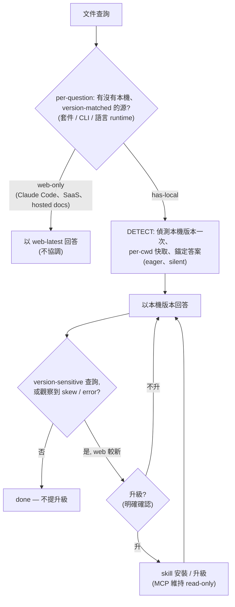

> [English](Version-Reconciliation) | 繁體中文

# 版本協調 — 先 detect，再 surface

當查詢有可解析的本機目標(已裝套件、CLI、或專案的語言 runtime)時, LiveDocs 把答案錨定在本機版本。核心規則:

> 以你的本機版本回答。web-latest 只用來判斷你是否落後、以及提供升級, 不當答案本身。

協調分兩相, 讓它 proactive 又不吵:

- Detect(eager、cached、silent):偵測本機版本一次、per-cwd 快取、把每個答案靜默錨在它。web-latest 靠 ETag revalidation 快取便宜地保持最新。
- Surface(lazy、只在相關時):只在答案 version-sensitive、或真的出現 skew/error 時才提示升級。

## 本機來源

- 已裝套件:`introspect{kind:"r-pkg", target:"<pkg>"}`(R; npm/pip 待做)。
- 已裝 CLI:`introspect{kind:"cli", target:"<cmd>"}`。
- 語言 runtime:`introspect{kind:"runtime", target:"<language>" 或 "auto"}`, 支援 Python、Node/TypeScript、Go、Rust、Java、C#/.NET、Swift。回傳有效 runtime 版本:active toolchain 權威;宣告的 pin(`.python-version`、`go.mod` `go`、`swift-tools-version`…)只 cross-check;bare constraint 或 language-mode 回 not-resolved 而非猜。專案 pin Python 3.11 就回 3.11 的答案, 不回 3.13。

## 說明

- 分類是 per-question。「怎麼設定 Claude Code」是 web-only;「已裝的 Python 有沒有這個 stdlib API」是 has-local。
- installed 解析是 cwd-scoped:Python venv、npm `node_modules`、或專案的 runtime toolchain, 不誤用 global。
- install 是需確認的 mutation, 由 skill 明確確認後執行。MCP 本身維持 read-only;只 introspect, 從不安裝。

另見:[Primary-Source 光譜](Primary-Source-Spectrum-zh-TW), 產品邊界。
