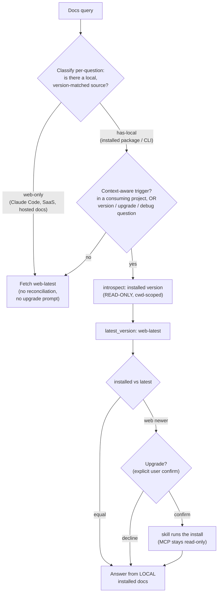

> English | [繁體中文](Version-Reconciliation-zh-TW)

# Version Reconciliation — the auto-detect update flow

When a target has both a web-latest and a locally installed version, LiveDocs detects the
gap and offers an upgrade. The rule that governs every branch:

> Answer from your local installed version. The web-latest is used only to detect that
> you're behind and to offer the upgrade, never as the answer itself.

## Notes

- Classification is per-question. The same tool can be both: "how do I configure Claude Code"
  is web-only; "what flags does the installed `claude` take" is has-local.
- The context-aware trigger fires only when reconciliation is warranted (inside a consuming
  project, or a version / upgrade / debug question), to bound latency.
- Installed resolution is cwd-scoped: npm `node_modules`, a Python venv, or R `.libPaths()` of
  the current project, never a misleading global assumption.
- Install is a confirmed mutation, run by the skill after explicit confirmation. The MCP itself
  stays read-only; it introspects, it never installs.

See also: [Primary-Source Spectrum](Primary-Source-Spectrum), the product boundary.
