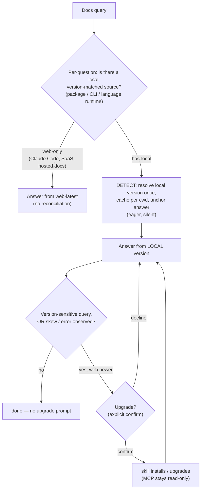

> English | [繁體中文](Version-Reconciliation-zh-TW)

# Version Reconciliation — detect, then surface

When a query has a resolvable local target (an installed package, a CLI, or the project's
language runtime), LiveDocs anchors the answer to the local version. The governing rule:

> Answer from your local version. The web-latest is used only to detect that you're behind
> and to offer an upgrade, never as the answer itself.

Reconciliation runs in two phases so it can be proactive without being noisy:

- Detect (eager, cached, silent): resolve the local version once, cache it per working
  directory, and anchor every answer to it. Web-latest stays current cheaply through the ETag
  revalidation cache.
- Surface (lazy, only when relevant): prompt about upgrading only when the answer is
  version-sensitive or an actual skew/error shows up.

## Local sources

- Installed package: `introspect{kind:"r-pkg", target:"<pkg>"}` (R; npm/pip to come).
- Installed CLI: `introspect{kind:"cli", target:"<cmd>"}`.
- Language runtime: `introspect{kind:"runtime", target:"<language>" or "auto"}` for Python,
  Node/TypeScript, Go, Rust, Java, C#/.NET, and Swift. It returns the effective runtime
  version: the active toolchain is authoritative; declared pins (`.python-version`, `go.mod`
  `go`, `swift-tools-version`, …) only cross-check; a bare constraint or a language-mode
  declaration returns not-resolved rather than a guessed version. A project pinned to Python
  3.11 gets 3.11 answers, not 3.13.

## Notes

- Classification is per-question. "how do I configure Claude Code" is web-only; "does the
  installed Python have this stdlib API" is has-local.
- Installed resolution is cwd-scoped: a Python venv, npm `node_modules`, or the project's
  runtime toolchain, never a misleading global assumption.
- Install is a confirmed mutation, run by the skill after explicit confirmation. The MCP itself
  stays read-only; it introspects, it never installs.

See also: [Primary-Source Spectrum](Primary-Source-Spectrum), the product boundary.
